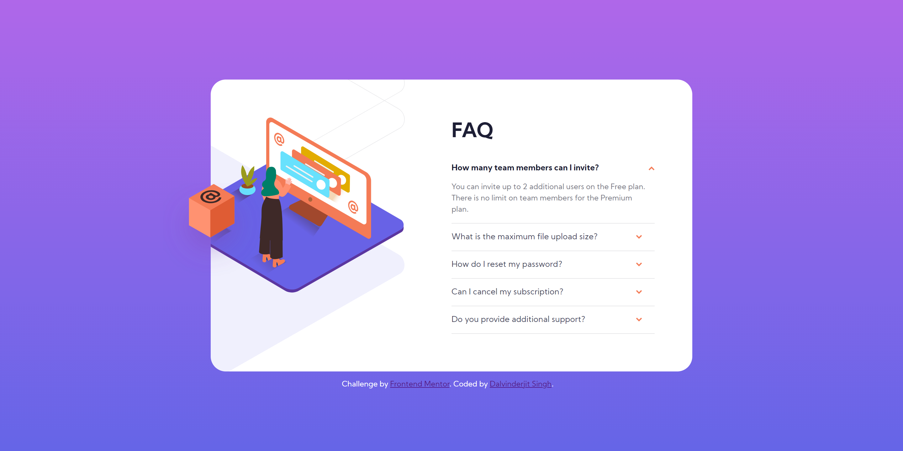

# Frontend Mentor - FAQ accordion card solution

This is a solution to the [FAQ accordion card challenge on Frontend Mentor](https://www.frontendmentor.io/challenges/faq-accordion-card-XlyjD0Oam). Frontend Mentor challenges help you improve your coding skills by building realistic projects.

## Table of contents

- [Overview](#overview)
  - [The challenge](#the-challenge)
  - [Screenshot](#screenshot)
  - [Links](#links)
- [My process](#my-process)
  - [Built with](#built-with)
  - [What I learned](#what-i-learned)
  - [Useful resources](#useful-resources)
- [Author](#author)

## Overview

### The challenge

Users should be able to:

- View the optimal layout for the component depending on their device's screen size
- See hover states for all interactive elements on the page
- Hide/Show the answer to a question when the question is clicked

### Screenshot



### Links

- Solution URL: [https://www.frontendmentor.io/profile/dalvinderjitsingh/solutions](https://www.frontendmentor.io/profile/dalvinderjitsingh/solutions)
- Live Site URL: [https://dalvinderjitsingh.github.io/frontend-mentor-challenges/faq-accordion-card](https://dalvinderjitsingh.github.io/frontend-mentor-challenges/faq-accordion-card)

## My process

### Built with

- Semantic HTML5 markup
- CSS custom properties
- Flexbox
- CSS Grid
- Mobile-first workflow

### What I learned

I learned how to use and style the details HTML element and it's accompanying summary HTML element to create a disclosure widget.

To see an example of how I implemented the HTML tags, see the code snippet below:

```html
<details>
  <summary>
    <h3>A summary of this disclosure widget.</h3>
    
  </summary>
  <p>
    Contents which would show up below the summary if the summary is clicked.
  </p>
</details>
```

Instead of using the default icon, I used an arrow icon which was part of the design of this challenge.

Here is the CSS to remove the default icon in all modern browsers:

```css
summary {
  list-style: none;
}

summary::-webkit-details-marker {
  display: none;
}
```

### Useful resources

- [MDN Web Docs](https://developer.mozilla.org/en-US/docs/Web/HTML/Element/details) - This is a resource I'd recommend to anyone who wants to learn about the details HTML element.

## Author

- Website - [Dalvinderjit Singh](https://dalvinderjitsingh.github.io/)
- Frontend Mentor - [@dalvinderjitsingh](https://www.frontendmentor.io/profile/dalvinderjitsingh)
- Twitter - [@dalvinderjit01](https://twitter.com/dalvinderjit01)
